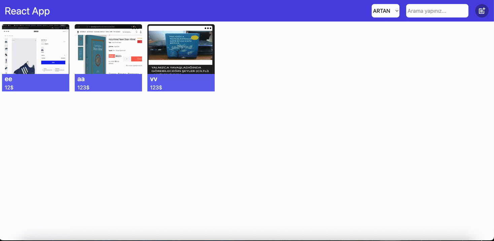

# 🛒 Product Management Application

This project is a React-based application designed for adding and managing products. It leverages **Redux Toolkit** for powerful state management and includes modern features to enhance the user experience.

## ✨ Features
- **Add and Edit Products**: Perform CRUD operations to add, edit, and delete products.
- **Modal Implementation**: Manage operations using user-friendly modal windows.
- **Search Functionality**: Easily search for products using the search input.
- **Sorting**: Sort products in ascending or descending order.
- **State Management**: Reliable state handling using Redux Toolkit.
- **Dynamic Routing**: Navigate between pages using React Router DOM.
- **Tailwind CSS**: Create modern, responsive, and customizable designs.

## 🛠️ Technologies and Libraries
- **React**: For building the user interface.
- **Redux Toolkit**: For modern state management.
- **React Router DOM**: For page navigation.
- **Tailwind CSS**: For styling.
- **Modal**: For handling user interactions.

